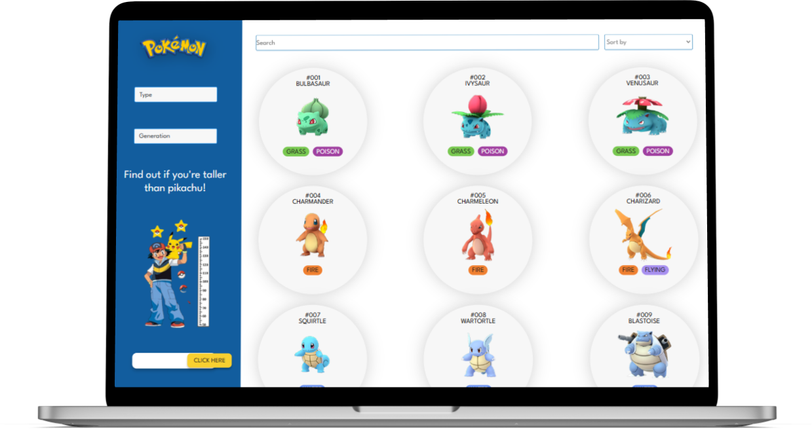
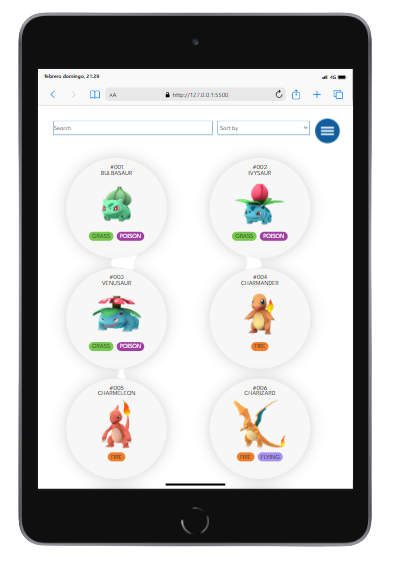
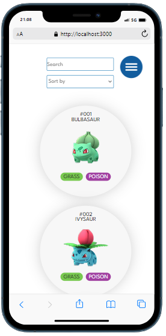
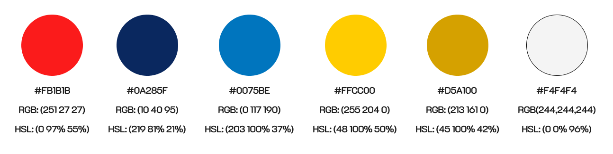
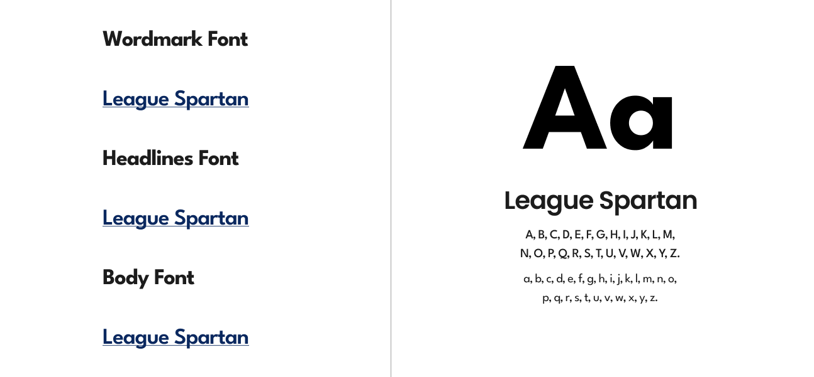

     

***

## Índice

* [1. Definición del producto ](#1-Definición-del-producto)
* [2. Hallazgos](#2-Hallazgos)
* [3. Objetivos de aprendizaje](#3-objetivos-de-aprendizaje)
* [4. Consideraciones generales](#4-consideraciones-generales)
* [5. Consideraciones técnicas](#5-consideraciones-técnicas)
* [6. Diseño de la Interfaz de Usuario](#6-Diseño-de-la-Interfaz-de-Usuario)
* [7. Testeos de usabilidad](#7-Testeos-de-usabilidad)
* [8. Autoras](#8-Autoras)

***

## Definición del producto 

Pokémon GO es una experiencia de juego internacional que cuenta con más de mil
millones de descargas y ha sido nombrada "el mejor juego para móviles" por
Game Developers Choice Awards y "la mejor aplicación del año" por TechCrunch
(tomado de Google Play). Los usuarios del juego se convierten en "Maestros/
entrenadores de Pokémon" y pueden:

- **Descubrir el mundo Pokémon:** explorar y descubrir nuevos Pokémon allá
  donde vayan.
- **Atrapar** distintos Pokémon para completar su Pokédex.
- **Pelear** contra Pokémon de otros entrenadores y conquistar un gimnasio.
- **Competir** en épicos combates contra otros entrenadores.
- **Hacer equipo** con otros entrenadores para atrapar poderosos Pokémon
  durante las incursiones.

## Hallazgos

Para entender mejor qué necesidades complementarias a la app tienen los
usuarios, hicimos una rápida investigación (research) y estos son algunos
de los hallazgos.

- Los Pokémon tienen características únicas que determinan las decisiones que
  toma el usuario (tipo, debilidad, peso, multiplicador, etc.)
- Un maestro Pokémon antes de salir a casar los Pokémon tienen que:
  saber el top 10 de frecuencia de aparición de los Pokémon.
- Los Pokémon tienen distintos tipos y debilidades de combate. Estas
  características son importantes cuando un maestro Pokémon elige al Pokémon
  más adecuado para su batalla. Hay veces que tiene que elegir a los que
  tienen menos cantidad de debilidades y saber de que tipo son. Por ello, es
  importante para un maestro Pokémon poder ordenarlos por estas 2
  características.
- Los Pokémon evolucionan y es importante para un
  maestro Pokémon saber cuántas y cuáles son las evoluciones que tienen antes y
  después.
- Los Pokémon se alimentan de caramelos y un maestro Pokémon necesita saber
  cuántos caramelos necesita un Pokémon para evolucionar.
* [Pokémon](src/data/pokemon/pokemon.json)
  En este set se ecuentra una lista con los 251 Pokémon de la región de Kanto
  y Johto, junto con sus respectivas estadísticas usadas en el juego [Pokémon GO](http://pokemongolive.com).

##  Objetivos de aprendizaje

El objetivo principal de este proyecto es aprender a diseñar y construir una
interfaz web donde se pueda visualizar y manipular data, entendiendo lo que el
usuario necesita.

## Consideraciones generales

* Interfaz desplegada: [Pokemon](https://alexandravaldez.github.io/DEV004-data-lovers/src/)

* La lógica del proyecto debe estar implementada completamente en JavaScript (ES6), HTML y CSS. 
En este proyecto NO está permitido usar librerías o
frameworks, solo [vanilla JavaScript](https://medium.com/laboratoria-how-to/vanillajs-vs-jquery-31e623bbd46e)

* Tiempo para completarlo: Como referencia 4 semanas.

## Consideraciones técnicas

#### Checklist

* [x] Usa VanillaJS.
* [x] Pasa linter (`npm run pretest`)
* [x] Pasa tests (`npm test`)
* [x] Pruebas unitarias cubren un mínimo del 70% de statements, functions y
  lines y branches.
* [x] Incluye _Definición del producto_ clara e informativa en `README.md`.
* [x] Incluye historias de usuario en `README.md`.
* [x] Incluye _Diseño de la Interfaz de Usuario_ (prototipo de alta fidelidad)
  en `README.md`.
* [x] Incluye el listado de problemas que detectaste a través de tests de
  usabilidad en el `README.md`.
* [x] UI: Muestra lista y/o tabla con datos y/o indicadores.
* [x] UI: Permite ordenar data por uno o más campos (asc y desc).
* [x] UI: Permite filtrar data en base a una condición.
* [x] UI: Es _responsive_.

#### Herramientas

* [Trello](https://trello.com/)
* [Figma](https://figma.com/)
* [Html](https://developer.mozilla.org/es/docs/Web/HTML)
* [JavaScript](https://developer.mozilla.org/es/docs/Web/JavaScript)
* [Css](https://developer.mozilla.org/es/docs/Web/CSS)
* [Git](https://git-scm.com/)
* [GitHub](https://github.com/)
* [GitHub Pages](https://pages.github.com/)
* [Node.js](https://nodejs.org/)
* [Jest](https://jestjs.io/)

## Historias de usuario

#### Primera historia:

Como: Nueva jugadora de pokemon
Quiero: Ver los pokemos con sus nombres, tipos y numero
Para: Poder identificarlos mas rapido.

##### - Criterios de aceptación
Quiero ver la imagen de mi pokemon,
Numero de identificación, nombre y tipo.

#### Segunda historia:

Como: Maestro de Pokemon
Quiero: Tener acceso a información de los pokemones
Para: Conocer cada detalle para los torneos

##### - Criterios de aceptación:
Como quiero conocer más a detalle de mis pokemones favoritos, 
quiero buscarlos y distinguirlos mejor por el tipo o por su generacion,
tener acceso a la información de cada uno como: 
cuanto tiene de ataque, defensa, etc. 

## Diseño de la Interfaz de Usuario

### Prototipo de alta fidelidad
  

***Laptop:***

***Tablet:***

     

***Celular:***

     

##### Paleta de colores

##### Fuente

## Testeos de usabilidad

Estos fueron los principales hallazgos descubiertos por el estudio de usabilidad:

* Agregar margen a las pokebolas
* Centrar las pokebolas para la pantalla movil
* Arreglar el buscador y el ordenar para que esten mas centrados

## Autoras
 [Lizbeth Peña](https://github.com/lizbethMelissaPS)

 
[Alexandra Valdéz](https://github.com/AlexandraValdez)

